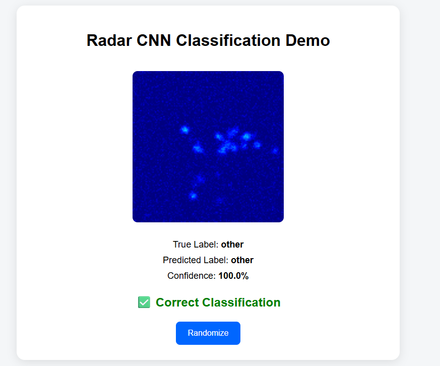
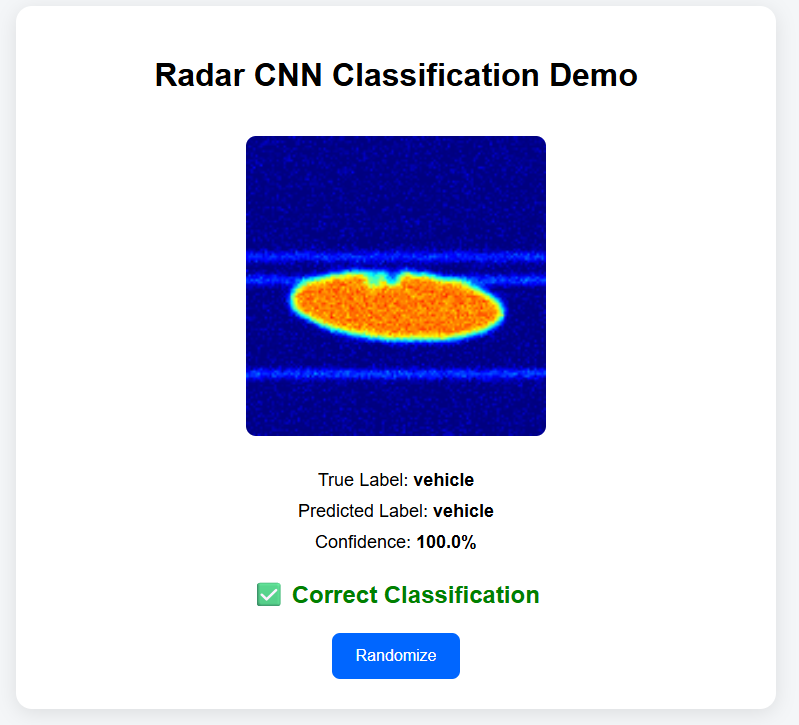
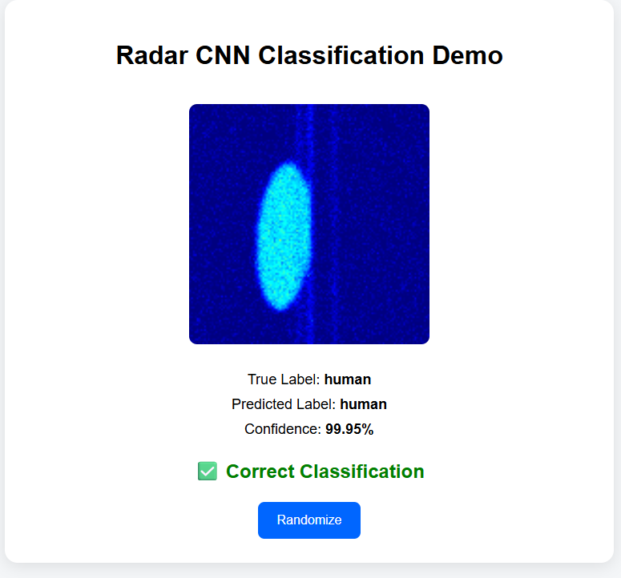
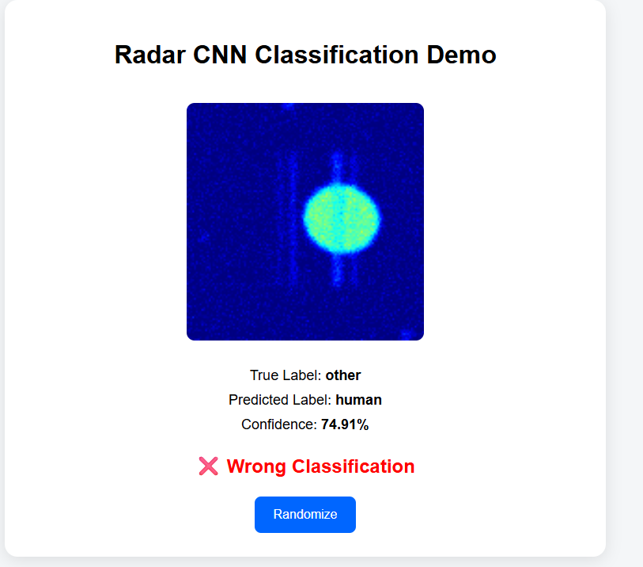
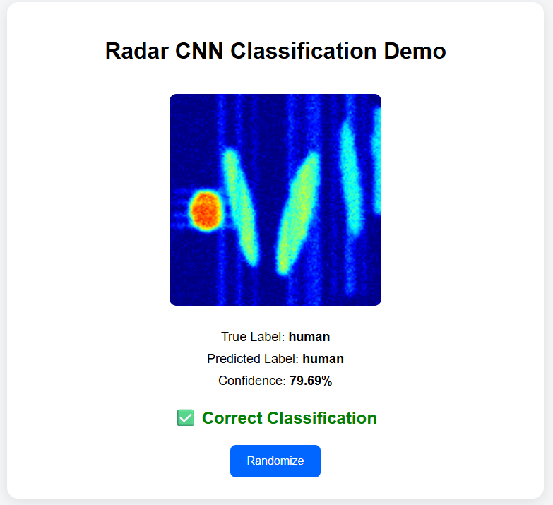

# Radar CNN Classification System

## Overview
CNN-based classification system for detecting and distinguishing objects (humans, vehicles, others) using radar-like representations.

Instead of relying on real radar sensor data, this project simulates radar-style inputs from image datasets to prototype a deep learning pipeline for object classification.

---

## Demo / Output Preview

### Sample Predictions







These outputs show model predictions across different object categories.

---

## Methodology

### Data Processing

The original RGB images are not used directly.

Instead:
- Object bounding boxes are extracted from annotation data  
- Regions of interest are isolated  
- Synthetic radar-like representations are generated  
- Labels are assigned based on dominant object class  

As documented: :contentReference[oaicite:0]{index=0}

This approach allows simulation of radar signal behavior for prototyping ML models.

---

### Model Training

- Convolutional Neural Network (CNN) used for classification  
- Input: transformed radar-like images  
- Output: class probabilities (human / vehicle / other)  
- Training includes:
  - preprocessing
  - normalization
  - dataset splitting (train / validation / test)

---

### Prediction Pipeline

- Preprocessed inputs are passed to trained model  
- Predictions are generated and visualized  
- Outputs stored in `outputs/` for analysis  

---

## Features

- CNN-based classification  
- Synthetic radar signal generation  
- End-to-end training and inference pipeline  
- Visualization of predictions and preprocessing  
- Modular structure (training, preprocessing, inference)

---

## Project Structure

- `data/` → datasets (train / val ignored, test included for demo)  
- `src/` → preprocessing, training, prediction scripts  
- `models/` → trained CNN model  
- `outputs/` → predictions, visualizations, preprocessing examples  
- `app.py` / `main.py` → entry points for running  

---

## Setup

```bash
git clone https://github.com/NirvikMazumdar/radar-cnn-classifier.git
cd radar_cnn_classification
python -m venv venv
venv\Scripts\activate   # Windows
pip install -r requirements.txt
```

---

## Run

### Train Model

```bash
python src/train.py
```

---

### Run Inference / Predictions

```bash
python run_model.py
```

---

### Run Full Pipeline (if applicable)

```bash
python main.py
```

---

## Strengths

- Full deep learning pipeline from preprocessing to prediction  
- Creative use of synthetic radar-like representations  
- Handles data transformation and feature extraction  
- Includes visual outputs for interpretation  
- Lightweight demo setup with test dataset  

---

## Limitations

### Synthetic Radar Representation
- Radar data is **not real sensor data**
- Generated from image transformations
- Does not capture true radar physics (Doppler, noise, reflection patterns)

### Dataset Constraints
- Limited variability compared to real-world radar data  
- Model generalization may be restricted  

### Model Behavior
- CNN learns image-based patterns, not true radar signal dynamics  
- Performance depends heavily on transformation quality  

---

## Scalability & Future Improvements

### Integration with Real Radar Systems
- Replace synthetic inputs with real radar sensor data  
- Use datasets such as **Cadre / radar-based datasets** for higher fidelity  

### Advanced Modeling
- Explore:
  - deeper CNN architectures  
  - transformer-based vision models  
  - multimodal learning (sensor + image fusion)  

### Real-World Deployment
- Integrate with smart infrastructure systems  
- Combine with IoT pipelines and real-time streams  

### Smart Lighting Integration (Link to Previous Project)
- Use radar-based object detection to:
  - detect presence (pedestrian / vehicle)
  - dynamically adjust lighting intensity  
- Enables **more accurate and responsive lighting profiles** compared to simulated traffic  

---

## Key Insight

This project is a **prototype pipeline**, demonstrating how radar-based object classification can be approached using deep learning.

While current inputs are synthetic, the architecture is designed to transition toward real-world radar data integration.

---

## Data Notes

- Train and validation datasets are excluded for size optimization  
- Test dataset is included for demonstration purposes  
- Outputs include predictions and preprocessing comparisons  

---

## Conclusion

This system demonstrates:
- how radar-like data can be modeled using CNNs  
- how synthetic data can bootstrap development  
- how such systems can scale toward real-world sensor-driven applications  
